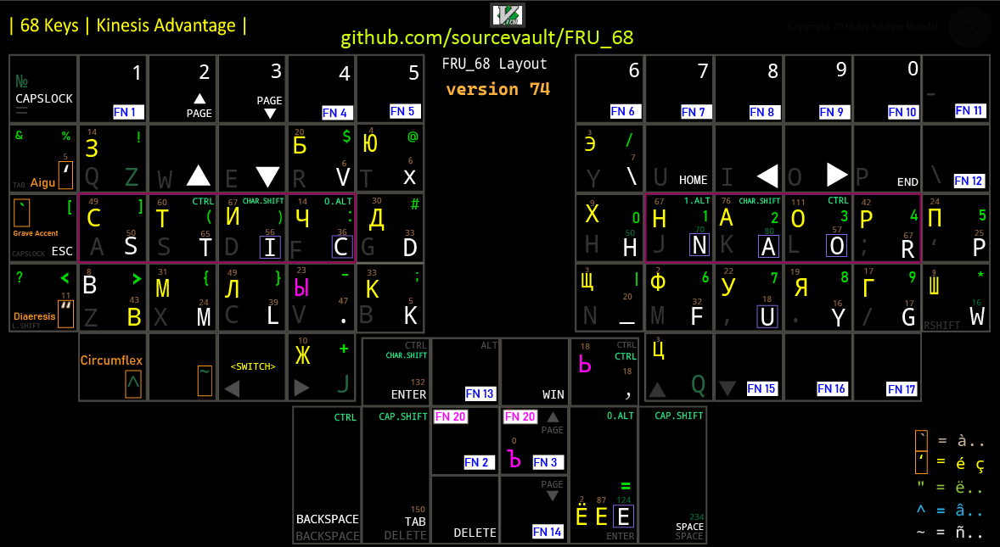

# EFR68

`⛔️ only for Windows ⛔️`

⚠️ code provided will only work for Kinesis Advantage 2 ( or keyboard with similar layout ) with the  bottom row `\` remapped to `F8`, the repo is kept mainly to show the layout design.

Combined language keyboard layout using [autohotkey](https://www.autohotkey.com) and [dual.ahk](https://github.com/lydell/dual/) targeting english, french and russian symbols.

Make sure to have your default english keyboard to English (United States) US.

#### Features

- Vim friendly by having numbers accessible in home row.

- Mouse friendly by having `Enter`, `Ctrl`, `Page UP` and `Page DN` on the left hand side.

- `F20` to allow defining customized key binding for newer commands to prevent clash with already defined commands under `Shift`,`Alt` and `Ctrl`.

- Cut, Copy, Paste, Undo all in friendly location.

- `Ctrl+minus` and `Ctrl+plus` on the left side to make it easy to zoom and zoom out.

- Optimized for use with Abode product, and navigating panes while using mouse.

#### LICENCE

- Code released under BSD-3-Clause.
- Documentation and images released under CC BY-NC-ND 4.0.
- details can be found [here](https://github.com/sourcevault/EFR68/blob/dev/COPYING.txt).
